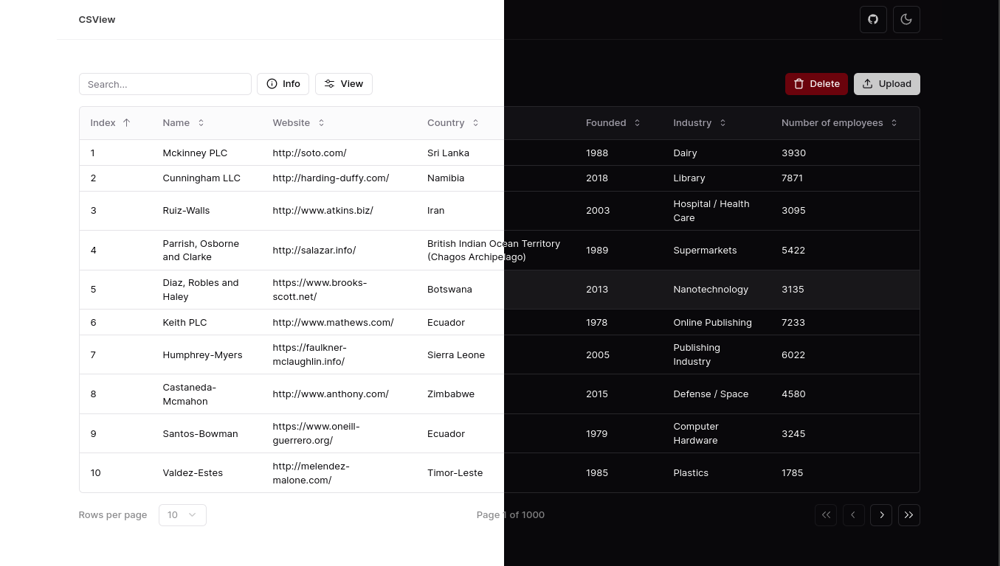

## CSView



CSView is a easy-to-use website for viewing CSV files in a dynamic table format. It allows users to upload CSV files and displays the data in a table with features such as sorting, filtering, and hiding columns. Live site: [CSView](https://csviewer.vercel.app)


### Features

- CSV Upload: Drag and drop or click to upload CSV files.
- Dynamic Table: Display CSV data in a dynamic table.
- Sorting: Sort columns in ascending or descending order.
- Filtering: Filter data based on column values.
- Column Visibility: Show or hide columns.
- Pagination: Navigate through large datasets.
- CSV Information: Display CSV information such as number of columns and rows, empty cells, column names, and file size.


### Getting Started

#### Clone the Repository
``` bash
git clone https://github.com/muhammad-zulfikar/CSView.git
cd CSView
```

#### Install Dependencies

``` bash
yarn install
```

#### Start the Development Server

``` bash
yarn dev
```

Open your web browser and navigate to http://localhost:3000.
